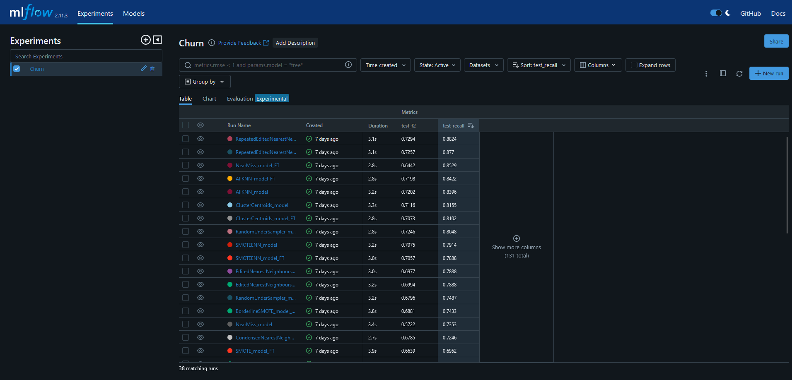

# **TFM: Efecto de las técnicas de balanceo en problemas de clasificación desequilibrados**
_Over y Undersampling aplicado a churn en empresas de telecomunicación_

<br>

**Autor**: Ángel Blanco García.  
**Tutora**: Irina Arévalo Barco.  
**Institución**: CUNEF Universidad.  
**Programa**: Máster Universitario en Ciencia de Datos.  

### **Datos de contacto**
[<font color='orange'>Correo</font>](angel.blanco@cunef.edu)  
[<font color='lime'>Github</font>](https://github.com/angelblancog)  
[Docker](https://hub.docker.com/u/angelbg34)

<div style="text-align: justify">

El aprendizaje automático es uno de los pilares fundamentales de la Ciencia de Datos en la actualidad. Son cada vez más las organizaciones que lo utilizan como herramienta para extraer valor de los datos que poseen y poder elaborar planes de actuación comerciales en base a fundamentos respaldados por la estadística. Los modelos de machine learning ayudan a los analistas porque pueden procesar grandes cantidades de datos y detectar patrones complejos con mayor precisión y eficiencia que los métodos tradicionales. La implementación de estos modelos lleva a la automatización de tareas repetitivas y, dicha automatización mejora la eficiencia operativa porque reduce la posibilidad de errores humanos.

A menudo, esta disciplina se utiliza para identificar grupos de datos con características similares y así poder predecir, con información nueva, a que grupo pertenecerán dichos datos. 

Sin embargo, el proceso de aplicación de estos modelos no es una tarea liviana puesto que, en muchos casos, la calidad de los datos disponibles no es suficientemente buena o existe una desigualdad entre la información que se posee sobre uno de los grupos con respecto al resto, lo que frecuentemente lleva a los modelos a sesgar su clasificación hacia el perfil más conocido. Es en estos casos en los que se recurre a la aplicación de técnicas de aumento de los datos de la clase infrarrepresentada o reducción de los de la clase mayoritaria para mejorar la precisión de estos modelos.

El objetivo de este trabajo es analizar los efectos de las diferentes técnicas de balanceo de clases sobre el latente problema del abandono de clientes y proporcionar una plantilla para todo aquel que desee seguir investigando o aportar otro enfoque al estudio.

Términos clave: undersampling, oversampling, churn, telecomunicaciones, machine learning, aprendizaje automático, abandono de clientes.

<div>

<br>

### **Estructura de carpetas:**

<br>

- [data/](data) con subcarpetas processed para datos finales y raw para el conjunto de datos vírgenes.

- [docs/](docs) contiene un markdown del diccionario de datos con algo de diseño, además de las versiones word del TFM y resumen ejecutivo.

- [html/](html) con los html de los notebooks utilizados.

- [images/](images) con las imágenes utilizadas.

- [mlruns/](metadata) con todos los archivos generados por mlflow al hacer los experimentos. 

- [models/](mlruns) que almacena los modelos que se han guardado en pickle.

- [notebooks/](notebooks) con los notebooks de los análisis.

- [pdfs/](pdfs) con una subcarpeta de pdfs bibliográficos y otra llamada project con el diccionario de datos, el tfm y resumen ejecutivo en pdf.

- [src/](src) donde se han guardado las funciones creadas para el trabajo. La estructura de los archivos py es la siguiente:

   - [__ init__.py/](src/__init__.py) archivo para que funcionen los imports de las otras funciones.

   - [metrics.py/](src/metrics.py) funciones para obtener las métricas de los modelos.

   - [mlflow_func.py/](src/mlflow_func.py) funciones para obtener las métricas de los modelos.

   - [plots.py/](src/plots.py) funciones para hacer gráficos.

- [requirements.txt](requirements.txt) que contiene el listado de librerías utilizado para el proyecto con cada una de sus versiones para facilitar la reproducibilidad del proyecto en otro ordenador.


<br>


### **Instrucciones de acceso a la interfaz de Mlflow desde la consola del ordenador (requiere python y virtualvenv instalados)**  

<br>

</div>  


1. Clonar repositorio de Github al entorno local:

   ```BASH Comando para clonar repo a local
   git clone https://github.com/angelblancog/churn.git
   ```

2. Acceder a la carpeta en la consola:

   ```BASH
   cd churn
   ```

3. Crear una carpeta de environment (lamada por ejemplo: .venv) y descargar las librerías del archivo requirements.txt:

   ```BASH
   py -m virtualenv .venv
   ```

   ```BASH
   cd .venv
   ```
   
   ```BASH
   pip install -r requirements.txt
   ```

4. Activar el environment:

    ```BASH
   cd ..
   ```

   ```BASH
   source .venv/bin/activate
   ```

5. Puesta en marcha de la interfaz:

   ```BASH
   mlflow ui
   ```

6. Acesso a la ruta de la interfaz:

        en la consola, hacer Ctrl + clic en el link que aparece

7. Debería abrirse una pestaña del explorador en la que se vea algo como lo que aparece en la imagen mostrada a continuación.

    <br>

    

    <br>

    Es posible que aparezca la interfaz sin ningún experimento en la pantalla si aún no se han ejecutado los notebooks del proyecto.

<div align="center">

</div>

<br>

<div align="center">

><font color="red">DISCLAIMER: este trabajo ha sido desarrollado con fines educacionales y de investigación, no para usar en producción real.</font>

<div>